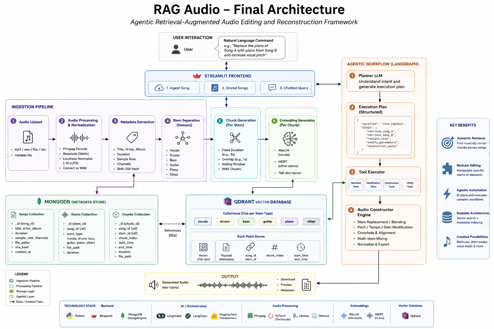

# RAG Audio
### Agentic Retrieval-Augmented Audio Editing and Reconstruction Framework

> A modular AI system that ingests songs, decomposes them into semantic audio assets, indexes them into a vector database, and reconstructs new audio compositions through natural language instructions.

---

## Overview

RAG Audio is an experimental framework for intelligent audio editing using Retrieval-Augmented Generation (RAG) principles.

Instead of treating a song as one continuous waveform, the system converts every song into reusable audio assets consisting of:

- Individual stems
- Temporal audio chunks
- Semantic embeddings
- Metadata
- Vector representations

These assets are later retrieved and recombined through an AI planning agent capable of executing complex audio editing workflows.

The goal is to transform songs into reusable building blocks rather than static recordings.

---

# Features

- Audio ingestion pipeline
- Automatic audio normalization
- Six-stem source separation using Demucs
- Temporal chunk generation with overlap
- Audio embedding generation
- Qdrant vector search
- MongoDB metadata storage
- Agentic workflow planning
- Natural language audio editing
- Modular audio reconstruction engine

Supported workflows include:

- Voice modification
- Stem replacement
- Mashups
- Similarity search
- Audio reconstruction

---
## Architecture


# Installation

## Prerequisites

Before running the project, ensure the following software is installed:

- Python 3.10+
- MongoDB Community Server
- Qdrant
- FFmpeg (available from command line)
- Git

---

## Clone the Repository

```bash
git clone <repository-url>
cd rag_audio
```

---

## Create Virtual Environment

Windows

```bash
python -m venv .venv
.venv\Scripts\activate
```

Linux/macOS

```bash
python3 -m venv .venv
source .venv/bin/activate
```

---

## Install Dependencies

```bash
pip install -r requirements.txt
```

If a `requirements.txt` file is not available:

```bash
pip install -e .
```

or

```bash
pip install .
```

depending on your installation method.

---

## Install FFmpeg

Verify installation:

```bash
ffmpeg -version
```

FFmpeg must be available in your system PATH since it is used for:

- Audio decoding
- Audio normalization
- Format conversion

---

## Start MongoDB

Ensure MongoDB is installed and  running before launching the application.

Default connection:

```
mongodb://localhost:27017/Audio_rag
```

---

## Start Qdrant
Open terminal rag_audio/data/qdrant

```
docker compose up -d
```

Default endpoint:

```
http://localhost:6333
```

Verify that the server is running before ingesting audio.

---

# Running the Application

Launch the Streamlit interface:

```bash
streamlit run rag_audio/app.py
```

or

```bash
python -m streamlit run rag_audio/app.py
```

The application will be available at:

```
http://localhost:8501
```

---

# Supported Audio Formats

Current ingestion supports formats accepted by FFmpeg, including:

- MP3
- WAV
- FLAC
- OGG
- M4A

---

# Data Storage

During execution, the following folders are populated automatically:

```
data/

input_data/
processed/
normalized/
stem_data/
chunks/
generated_audio/
```

MongoDB stores:

- Song metadata
- Stem metadata
- Chunk metadata

Qdrant stores:

- Chunk embeddings
- Retrieval metadata

---

# Streamlit Pages

## 1. Ingest Song

Purpose

Uploads a new song into the retrieval system.

Pipeline

```
Upload
↓
Validation
↓
Normalization
↓
Stem Separation
↓
Chunk Generation
↓
Embedding
↓
Qdrant Storage
↓
MongoDB Metadata
```

---

## 2. Stored Songs

Displays all songs currently indexed inside MongoDB.

Information displayed

- Song ID
- Title
- Artist
- Duration

---

## 3. Chatbot Query

Natural language interface for retrieval and reconstruction.

Current supported workflows:

- Similarity Search
- Voice Modification
- Stem Replacement
- Mashup Generation
- Audio Reconstruction

---

# Core Modules

| Module | Responsibility |
|---------|----------------|
| `ingest.py` | Audio validation, decoding, normalization, metadata extraction |
| `stem.py` | Demucs-based six-stem source separation |
| `chunking.py` | Temporal chunk creation with configurable overlap |
| `embeds.py` | Audio embedding generation using transformer models |
| `vector_db.py` | Qdrant indexing and similarity retrieval |
| `schema_*` | MongoDB document models |
| `agent.py` | LangGraph-based orchestration |
| `tools.py` | Retrieval, planning, reconstruction, and editing tools |
| `app.py` | Streamlit user interface |

---

# Typical Pipeline

```
Input Audio
      │
      ▼
Audio Validation
      │
      ▼
Audio Decoding
      │
      ▼
Normalization
      │
      ▼
Demucs Separation
      │
      ▼
Stem Metadata
      │
      ▼
Chunk Generation
      │
      ▼
Embedding Generation
      │
      ▼
Qdrant Indexing
      │
      ▼
Natural Language Agent
      │
      ▼
Audio Retrieval
      │
      ▼
Audio Reconstruction
      │
      ▼
Generated Audio
```

# Project Structure

```
rag_audio/

│
├── app.py
│
├── Ingestion/
│   └── ingest.py
│
├── embedders/
│   ├── embeds.py
│   ├── chunking.py
│   ├── stem.py
│   └── vector_db.py
│
├── core/
│   ├── agent.py
│   └── tools.py
│
├── data_schemas/
│   ├── schema_song.py
│   ├── schema_stem.py
│   ├── schema_chunks.py
│   └── ExecPlan.py
│
└── data/
    ├── input_data/
    ├── processed/
    ├── normalized/
    ├── stem_data/
    ├── chunks/
    └── generated_audio/
```

---

# Workflow

## 1. Audio Ingestion

Responsible for validating and preparing uploaded audio.

Operations

- Audio validation
- WAV conversion
- Sample rate normalization
- Loudness normalization
- Metadata extraction
- SHA hashing

Output

- Processed WAV
- Normalized WAV
- MongoDB Song Metadata

---

## 2. Stem Separation

Uses Facebook Research's Demucs model.

Generated stems

- Vocals
- Drums
- Bass
- Guitar
- Piano
- Other

Output

- Six independent audio tracks
- Stem metadata

---

## 3. Chunk Generation

Each stem is divided into overlapping temporal chunks.

Purpose

- Fine-grained retrieval
- Partial reconstruction
- Semantic indexing

Output

```
Song
 ├── Vocals
 │      ├── chunk_001.wav
 │      ├── chunk_002.wav
 │      └── ...
 │
 ├── Piano
 └── ...
```

---

## 4. Audio Embeddings

Each chunk is embedded using pretrained transformer models.

Current models

- WavLM
- MERT

Output

768-dimensional semantic vectors

---

## 5. Vector Database

Backend

- Qdrant

Collections

```
vocals
drums
bass
guitar
piano
other
```

Each point stores

- Embedding
- Song ID
- Stem ID
- Chunk ID
- Timing metadata

---

## 6. Metadata Database

Backend

MongoDB

Collections

- Songs
- Stems
- Chunks

Stores

- Audio metadata
- File locations
- Relationships
- Chunk references

---

## 7. Agentic Planning

Natural language requests are converted into structured execution plans.

Example

```
Replace the piano from Song A
with the piano from Song B.
```

↓

Execution Plan

```
Retrieve Song A
Retrieve Song B
Extract Piano Stem
Replace Piano
Reconstruct Audio
```

---

## 8. Audio Constructor

Unlike traditional mixers, the constructor operates on reusable assets.

Capabilities

- Stem replacement
- Stem blending
- Melody fusion
- Weighted reconstruction
- Voice modification
- Mashups

This module is designed as an extensible audio constructor rather than a fixed audio mixer.

---

# Streamlit Interface

The application currently provides three primary endpoints.

## Ingest Song

Uploads a song into the retrieval system.

Pipeline

```
Upload

↓

Normalize

↓

Separate Stems

↓

Chunk

↓

Embed

↓

Store
```

---

## Stored Songs

Displays indexed songs currently available.

Shows

- Title
- Artist
- Duration
- Song ID

---

## Chatbot Query

Natural language interface.

Example requests

```
Find songs similar to this recording.

Replace the piano with a violin recording.

Mix the vocals of Song A with the melody of Song B.

Increase vocal pitch.

Generate a mashup using only piano and bass.
```

---

# Technology Stack

### Backend

- Python
- Streamlit
- MongoEngine
- MongoDB

### AI

- LangGraph
- LangChain
- HuggingFace Transformers
- WavLM
- MERT

### Audio

- FFmpeg
- Torchaudio
- Librosa
- Demucs

### Vector Database

- Qdrant

---

# Future Improvements

- Diffusion-based audio generation
- Intelligent stem alignment
- Beat synchronization
- BPM detection
- Key detection
- Semantic music editing
- Multi-track timeline editing
- Plugin architecture
- Real-time reconstruction

---

# Outcomes

This project demonstrates:

- Retrieval-Augmented Generation for audio
- Agentic workflow planning
- Audio source separation
- Vector similarity search
- Semantic audio retrieval
- AI-driven reconstruction
- Modular audio processing pipelines
- Production-oriented backend architecture

---

# Copyright & Attribution

© 2026 Manish Rana

This project was developed by **Manish Rana** as part of ongoing research and development in Retrieval-Augmented Audio Processing and Agentic AI systems.

You are welcome to:

- Learn from the code
- Use portions of the implementation in personal or academic projects
- Modify and extend the project
- Reference it in your own work

If you use substantial parts of this project or build upon it, please provide appropriate credit by linking back to this repository or mentioning the original author.

Contributions, suggestions, and improvements are always welcome.
